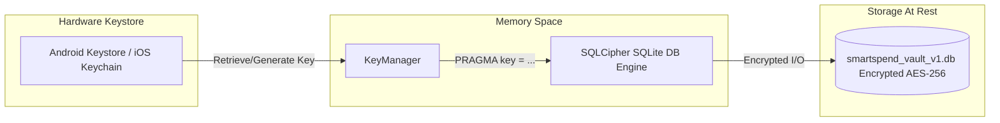

# SmartSpend — System Architecture Specification

## 1. Architectural Philosophy

SmartSpend is designed around three non-negotiable core principles:
1. **Privacy-First & Offline-First**: No data is transmitted to external servers. The local database is protected by SQLCipher AES-256 with keys generated inside hardware security modules (Android Keystore / iOS Keychain).
2. **Determinism & Idempotency**: Parsing uses strict contextual regex patterns and deterministic rules rather than black-box machine learning. Repeated rescans of the device SMS inbox produce zero duplicate transactions.
3. **Clean Architecture Decoupling**: Strict unidirectional dependency flow from Presentation down to Data through an independent Domain core.

---

## 2. Layered Architecture Diagram

```
┌─────────────────────────────────────────────────────────────────────────────┐
│                            PRESENTATION LAYER                               │
│  - Screens: DashboardScreen, TransactionsScreen, AccountsScreen, etc.       │
│  - Widgets: SummaryCards, TransactionTile, ChartWidgets                     │
│  - State Management: Riverpod Providers (StateProvider, FutureProvider)    │
│  - Navigation: GoRouter with ShellRoute                                     │
└──────────────────────────────────────┬──────────────────────────────────────┘
                                       │ (Depends only on Application & Domain)
                                       ▼
┌─────────────────────────────────────────────────────────────────────────────┐
│                            APPLICATION LAYER                                │
│  - Use Cases: IngestSmsUseCase, CorrectionUseCase, ExportBackupUseCase      │
│  - Pipeline Orchestration & Reversible Audit Logging                        │
└──────────────────────────────────────┬──────────────────────────────────────┘
                                       │ (Depends only on Domain)
                                       ▼
┌─────────────────────────────────────────────────────────────────────────────┐
│                              DOMAIN LAYER                                   │
│  - Entities: SmsRecord, ParsedTransaction, Account, CreditCard, Bill, etc.  │
│  - Enums: Bank, TransactionType, Confidence, BillStatus                     │
│  - Value Objects: Money, AccountRef, CardRef                                │
│  - Repository Contracts: ISmsRepository, ITransactionRepository, etc.       │
└──────────────────────────────────────▲──────────────────────────────────────┘
                                       │ (Implemented by Data Layer)
┌──────────────────────────────────────┴──────────────────────────────────────┐
│                              DATA LAYER                                     │
│  - Data Sources: Android SmsDatasource (ContentResolver), EncryptedDatabase │
│  - Repository Implementations: SmsRepository, TransactionRepository, etc.   │
│  - Parser Pipeline: Normalizer, InstitutionDetector, BankRules, Validator   │
│  - Reconciliation: Reconciler                                               │
└─────────────────────────────────────────────────────────────────────────────┘
```

---

## 3. SMS Parser & Ingestion Pipeline Data Flow

```mermaid
flowchart TD
    A[Incoming SMS / Inbox Query] --> B[Normalizer: Clean Unicode, Collapse Spaces, Strip URLs]
    B --> C[Fingerprint Generator: SHA-256 sender|timestamp|body]
    C --> D{Fingerprint Exists in DB?}
    D -- Yes --> E[Skip Ingestion: 0 Duplicates Guaranteed]
    D -- No --> F[Persist Immutable Raw SMS Record]
    F --> G[Institution Detector: Match Sender ID or Body Tokens]
    G --> H{Institution Detected?}
    H -- Yes --> I[Dispatch to Bank-Specific Rule Set]
    H -- No --> J[Dispatch to FASTag or Generic Contextual Rule]
    I --> K{Matched Bank Rule?}
    K -- Yes --> L[Extract All Financial Fields + Set HIGH Confidence]
    K -- No --> J
    J --> M[Extract Amounts, Identifiers, Context + Set MEDIUM/LOW Confidence]
    L --> N[Validator: Range, Date Sanity, Consistency Checks]
    M --> N
    N --> O[Reconciler: Check Refunds, Reversals, Card Payments]
    O --> P[Persist Parsed Transaction in Encrypted DB]
    P --> Q[Update Derived Balances: Accounts, Cards, Bills, FASTag]
```

---

## 4. Security Architecture



1. **At-Rest Protection**: Database tables (`raw_sms`, `parsed_transactions`, `accounts`, `cards`, `bills`, `fastag`) are encrypted via AES-256 before disk writes.
2. **Identifier Masking**: All UI widgets display masked identifiers (`•••• 4000`).
3. **Audit Log**: Every user edit creates a non-destructive entry in `corrections`.
